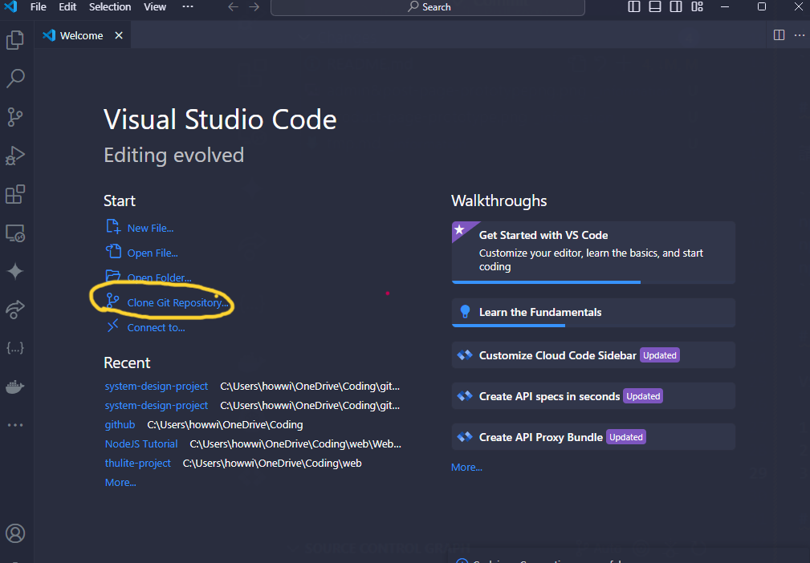
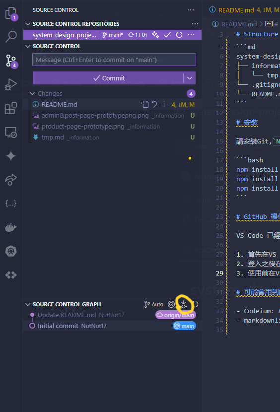
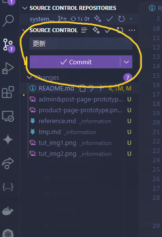
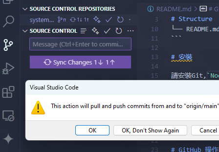
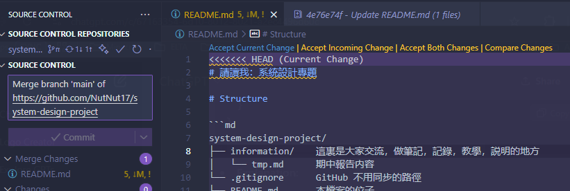
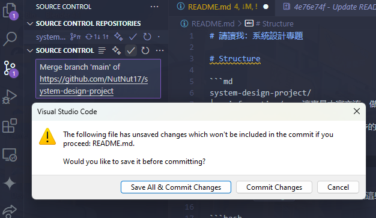

# 請讀我：系統設計專題

1. 關於我們所使用的web tech，如果有不明白可以閲讀我做的筆記，裏面記錄著我第一次做網站的筆記，也就是本作業[Nut17 Notes](https://nutnut17.github.io/thulite-project/docs/web/web-tech-stack/)

2. 未完成作業和分工請到TODO.md看
   
3. 請到`./_information/reference.md` 看相關筆記

## Structure

```md
system-design-project/
├── _information/   這裏是大家交流，做筆記，記錄，教學，説明的地方
│   └── tmp.md      期中報告内容
├── frontend/       這是前端的資料夾，在這裏跑`npm run dev`啓動web server
├── backend/        這是後端的資料夾，在這裏跑`node server.js`啓動web server
└── .gitignore      GitHub 不用同步的路徑
└── README.md       本檔案的位子
```

## 安裝

請安裝`git`和`Node.js`后在terminal下載這些dependencies

```bash

npm install -g @vue/cli
npm install express
npm install cors
npm install concurrently
npm install dotenv
# At ./frontend/
npm install primevue @primevue/themes
npm install primeflex
npm install primeicons
```

## GitHub 操作

VS Code 已經有結合GitHub的功能，不需要額外下載然和東西

1. 首先在VS Code登入你的Github賬號，沒有賬號就先注冊
2. 登入之後在首頁複製git空間(Clone Git Repository)，輸入這個網址`https://github.com/NutNut17/system-design-project`就會把共享空間轉到你的電腦。注意看圖片黃色圈圈 
3. 使用前在VS Code左邊第三個欄位（Source Control）更新至最新版本 
4. 做好更變后，請在（Source Control）裏確認更新資訊，好了按 Commit交出更新  
5. 如果有衝突的的話，git會打開頁面讓你確認衝突的情形。解決好衝突的話，確認程式沒問題就按接受變化(Accept Changes)，然後再pull and push  
6. 到GitHub Repository看有沒有成功更新，或者在(Source Control)左下角有沒有顯示合并成功的圖 

## 可能會用到的 VS Code Extension

- Codeium: AI 輔助
- markdownlint
- SQLite Viewer
- Vue - Official
  